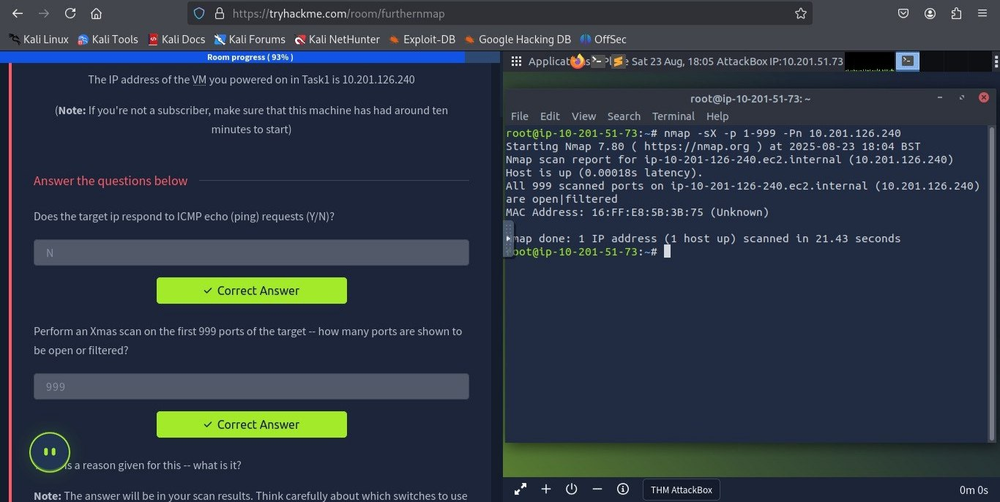
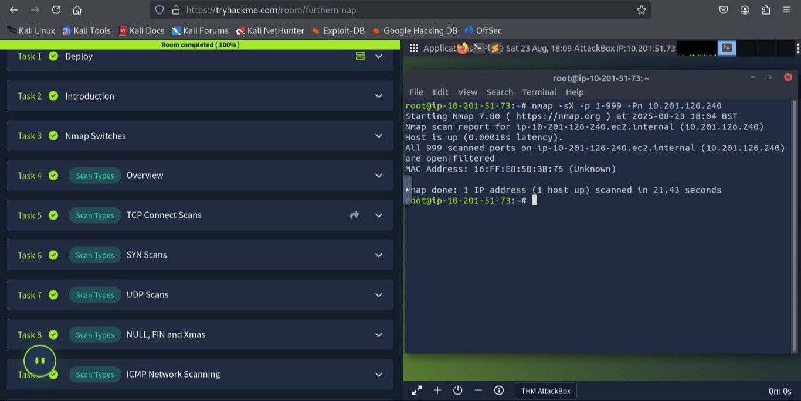
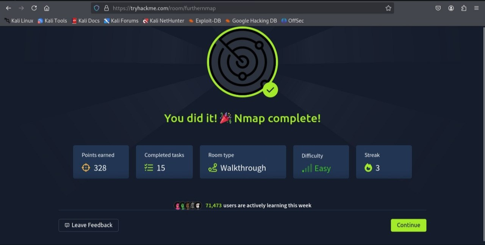

# Nmap Basics - Day Lesson Summary

## Overview
Learned how to use **Nmap** for network scanning, port enumeration, and basic reconnaissance.

## Key Points
- **Port Scanning:** Identify open/filtered ports (TCP, UDP). Well-known ports: 0-1023.
- **Scan Types:** 
  - TCP Connect (-sT)  
  - SYN Scan (-sS)  
  - UDP Scan (-sU)  
  - NULL/FIN/Xmas (-sN/-sF/-sX)  
- **Useful Switches:**  
  - `-Pn` → Skip ping  
  - `-p` → Specify ports  
  - `-sV` → Service version detection  
  - `-O` → OS detection  
  - `--script=<category>` → NSE scripts (e.g., ftp-anon)  
  - `-v` → Verbosity  
- **Firewall Evasion:** Fragment packets (`-f`), scan delays, append random data (`--data-length`)  
- **NSE Scripts:** Written in **Lua**, categories include `safe`, `vuln`, `exploit`, `auth`, `brute`, `discovery`.  

## Takeaway
Nmap is a powerful tool for **enumeration, vulnerability scanning, and network mapping**.

# Project Images

Here are some screenshots from the project:

---
📌 **Note**  
If you need the answers for this room/lab, feel free to contact:  tohidul07890@gmail.com 
---
